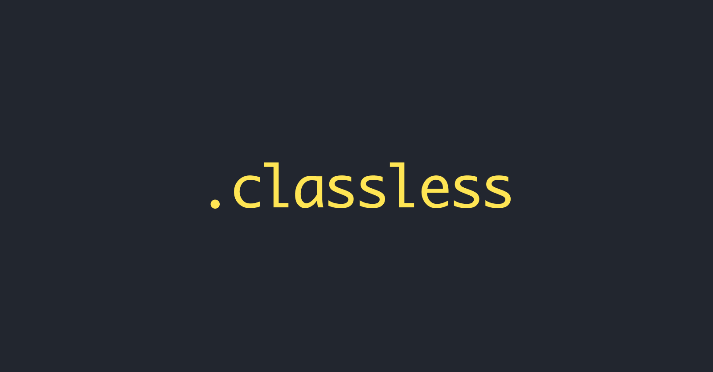

# classless-css

## Wait, what is classless CSS?
Classless CSS (also called no-class CSS) themes do not use ID's or classes. So, as long as your HTML is valid, they will work without you having to do any extra work!

## Light
[beech.css](https://github.com/y-arjun-y/beech.css)  
[sunny.css](https://github.com/y-arjun-y/sunny.css)  
[beech-red.css](https://github.com/y-arjun-y/beech-red.css)

## Dark
[milkomeda.css](https://github.com/y-arjun-y/milkomeda.css)  
[beech-dark.css](https://github.com/y-arjun-y/beech-dark.css)
